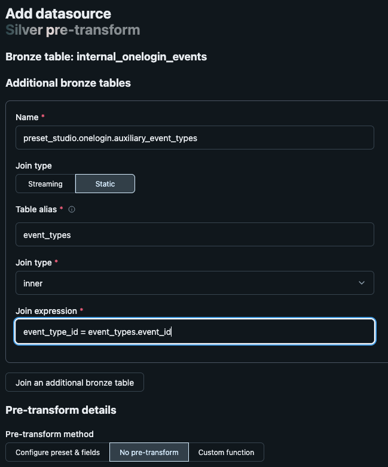

# OneLogin presets

This preset contains data processing instructions for the Onelogin events.

## Exploration & Research

- [Onelogin Event Overview](https://developers.onelogin.com/api-docs/2/getting-started/dev-overview)
- [Onelogin Event Types](https://developers.onelogin.com/api-docs/1/events/event-types)
- [Onelogin Event Format](https://developers.onelogin.com/api-docs/1/events/event-resource)
  - A list of the currently exported events that can appear in the event stream.
  - Used an event type ID to map the event toy a type. Note, event type names must be collected separately.


## Limitations
- Currently, this preset only supports up to the silver stage
- Mapping event type IDs to event types is not natively supported.


## Usage recommendations
- Should the user wish to extend the silver table to include event names, it is suggested that they materialise
  the output from the [Onelogin Event Types](https://developers.onelogin.com/api-docs/1/events/event-types) into
  a table. Then, when creating the preset, join this table as part of the silver.bronzeTables:
  - UI Example:
    
  - Yaml Example:
    ```yaml
    bronzeTables: 
    - alias: event_types
      joinExpr: event_type_id = event_types.event_id
      joinType: inner
      name: preset_studio.onelogin.auxiliary_event_types
      streaming: false
    ```
    

